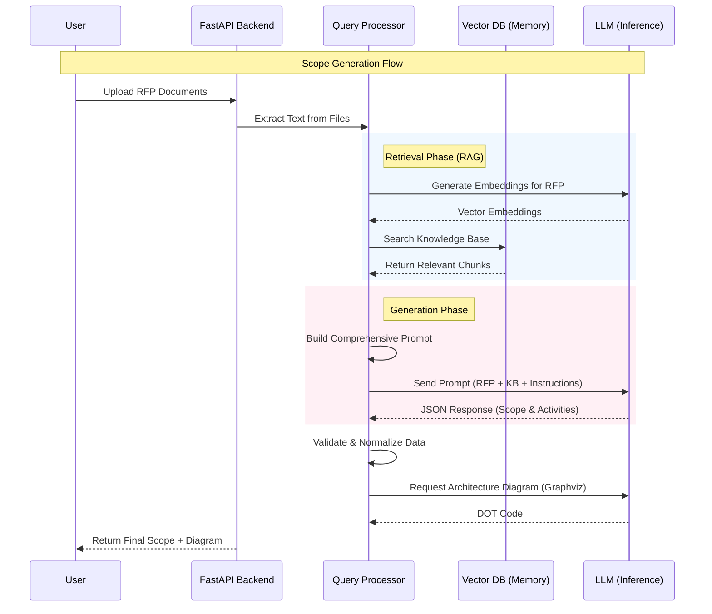

# LLM Workflow Architecture

This document outlines how the **AI-Powered Project Scoping Bot** uses Large Language Models (LLMs) to generate project scopes, questions, and case studies.

## High-Level Overview

The application utilizes a **Retrieval-Augmented Generation (RAG)** architecture. It combines the power of **Ollama** (for local LLM inference) with **Qdrant** (a vector database) to ground the AI's responses in specific project documents and your organization's knowledge base.

### Key Components

1.  **LLM Service**: **Ollama** (running models like Llama 3, Mistral, etc.) - Responsible for reasoning, text generation, and JSON formatting.
2.  **Vector Database**: **Qdrant** - Stores semantic embeddings of your Knowledge Base (KB) and Case Studies to allow the AI to "mememory" and retrieve relevant information.
3.  **Backend Logic**: **FastAPI + Scope Engine** - Orchestrates the flow, handles file processing, and manages the prompts.

---

## Detailed Workflow Steps

### 1. Scope Generation Pipeline
**Endpoint:** `POST /api/projects/{id}/generate_scope`

This is the core workflow of the application.

1.  **Input Processing**:
    *   The user uploads RFP documents (PDF, DOCX, etc.).
    *   The system extracts raw text from these files.

2.  **Retrieval (RAG)**:
    *   **Contextual Search**: The system analyzes the RFP text and queries **Qdrant** to find relevant chunks from your Knowledge Base (e.g., "How do we usually handle healthcare compliance?").
    *   **Smart Document Chunking**: If the RFP is large, the system intelligently retrieves only the most relevant sections (e.g., "technical requirements", "budget") to avoid exceeding the LLM's context window.

3.  **Prompt Engineering**:
    *   The system constructs a massive, structured prompt containing:
        *   **Project Metadata**: (Name, Domain, inferred Tech Stack).
        *   **RFP Content**: The extracted text from the user's files.
        *   **Retrieved Context**: Relevant snippets from the Knowledge Base.
        *   **Clarification Answers**: If the user has answered any generated questions, these are injected to guide the model.
        *   **Strict JSON Schema**: Instructions forcing the LLM to output data in a specific JSON format (Activities, Overview, Resourcing).

4.  **Inference**:
    *   The prompt is sent to **Ollama**.
    *   The LLM generates a JSON response representing the project scope.

5.  **Post-Processing**:
    *   The system validates and repairs the JSON output.
    *   It normalizes dates, activity durations, and role assignments to ensure they match valid rate cards.

6.  **Architecture Generation**:
    *   A separate specialized prompt asks the LLM to generate **Graphviz DOT** code.
    *   This code is rendered into a visual architecture diagram.

### 2. Question Generation Pipeline
**Endpoint:** `POST /api/projects/{id}/generate_questions`

1.  The system analyzes the RFP to identify ambiguous areas or missing information.
2.  It uses the Knowledge Base to understand what usually needs to be defined (e.g., "For a fintech app, we typically need to ask about PCI-DSS level").
3.  The LLM generates a list of categorized clarification questions.

### 3. Case Study Matching
**Endpoint:** `GET /api/projects/{id}/related_case_study`

1.  The system generates an **Embedding Vector** for the current project's Executive Summary.
2.  It performs a **Similarity Search** in the `case_studies` collection in Qdrant.
3.  **Semantic Match**: If a past case study is mathematically similar (e.g., > 65% match), it is returned.
4.  **Synthetic Fallback**: If no match is found, the LLM is instructed to "hallucinate" (generate) a *realistic, synthetic case study* based on the project's domain, which is marked as "Pending Approval".

---

## Visual Workflow Diagram

## Technology Stack Key

*   **Language**: Python (FastAPI)
*   **LLM Engine**: Ollama (local)
*   **Vector DB**: Qdrant (local docker container)
*   **File Storage**: Azure Blob Storage (simulated or real)
